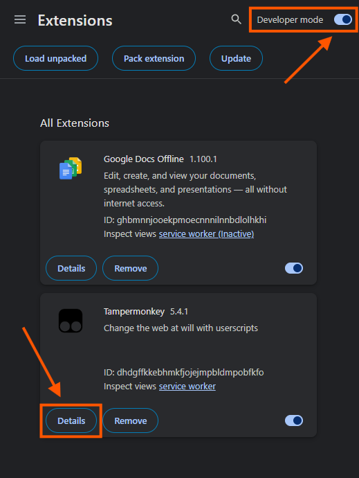
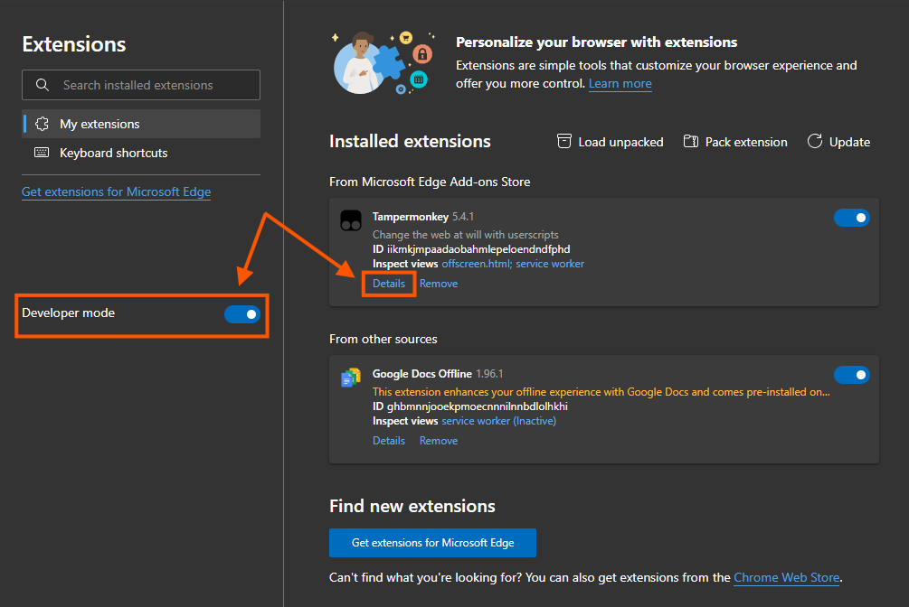
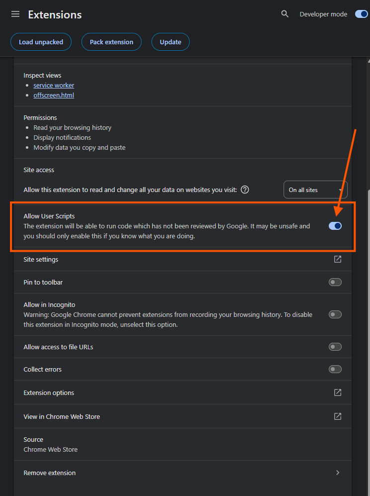
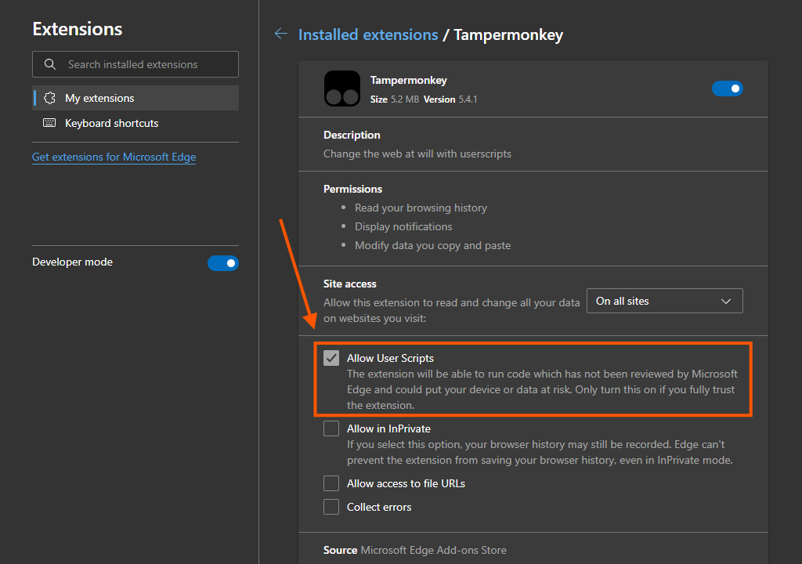
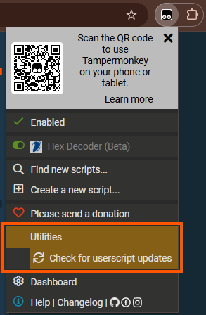
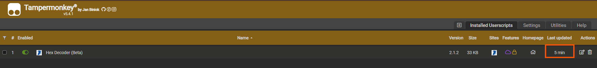

<div align="center">
	<br>
		
	<br>
	<h3>...This tool is made freely for specific use and a specific platform. Don't forget to give it a star if you are happy with what I am doing, it is highly appreciated....</h3>
</div>

--- 

## ❓ What's in it...?
The main purpose is to decode HEX, while it contains some other small features that you might need in some cases:<br>
 - Decode <b>HEX</b> & <b>BASE64</b> (<i>UTF-8</i> and <i>UTF-16LE</i> Supported) with Mass decoding (HEX only) & Highline decoding. <br>
 - Copy Column.<br>
 - Format Log.<br>

## 🌟 Anything new... or 🛠️ improvements?
This tool is still in a BETA version. I'm trying to update at least every quarter something new based on feedback I revieved. The latest version is now <u><b>2.1.4</u></b> comes with new features:<br>
 - AUTO mode: Press and hold "Bấm zô để ấy" for about 1 second to enter AUTO mode. Note that this function is limited to the current tab and applies to individual searches. Repeat the action to disable.

and improvements: 
 - Added new log format: ASM
 - Copy column is now can copy <b>Selected Row</b>, auto <b>Remove Duplicates</b> and support <b>Escape Characters: \n \t</b>
 - Copy data inline: Fixed an issue where copying highlighted text was difficult due to the UI toggling between encoded and decoded views. I’ve added a delay to better distinguish between a <b>Copy action</b> and a <b>Simple click</b>.!
 - Fix UI in dark theme.
 - Fix frame size for BASE64 POP UP. <br> <br>

> "If debugging is the process of removing bugs, then programming must be the process of putting them in."<br>
> — **Sam Redwine**<br>

<br>

---

## 🚀 Getting started...?
<a href="https://www.tampermonkey.net/">TAMPERMONKEY</a> is required to use this Hex Decoder. Navigate to extension store in your brower and search for Tampermonkey, or just choose the link below: 
| Brower &nbsp;| Link to Extension |
| ------------- | ------------- |
| Google Chrome  | https://chromewebstore.google.com/detail/tampermonkey/dhdgffkkebhmkfjojejmpbldmpobfkfo  | 
| Microsoft Edge  | https://microsoftedge.microsoft.com/addons/detail/tampermonkey/iikmkjmpaadaobahmlepeloendndfphd  | 

<i>*Note: Hex Decoder is fully tested on Google Chrome. It may work in other browsers, but it might not be as stable. Using Google Chrome is highly recommended.</i>

If you're installing Tampermonkey for the first time, please grant it permission to run Users Scripts; otherwise, my tool won't work correctly. Details below: <br>

1. Enable Developer Mode.
2. Go to Details.
3. Enable "Allow User Scripts". 

| Google Chrome | Microsoft Edge |
| ------------- | ------------- |
|    |   | 
|   |   |  

## 📥 Install scripts and 🔄 Update.
Once the base is installed, let's move to the core. Paste this link directly into your browser's address bar, Tampermonkey will automatically detect Hex Decoder and prompt you to install it: 
```
https://cdn.jsdelivr.net/gh/AZAOWEN2/Hex_Decoder@main/main.user.js
```

By default, Tampermonkey automatically checks for updates daily. However, due to occasional functional issues, it may fail or delayed. Therefore, here are two ways to manually update to the latest scripts:<br>
<div align="center">
<b>Update via the pinned extension icon in the browser toolbar:</b><br>
		
	<br><br><br>
 <b>Update via dashboard:</b><br>
		
	<br>
</div>

<br><br><br>
✨ That’s all! Now you're all set. If you encounter any issues during the installation, just let me know. <br>
And have a great day...